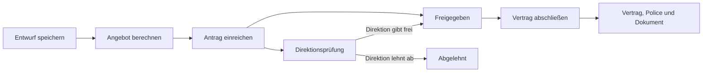
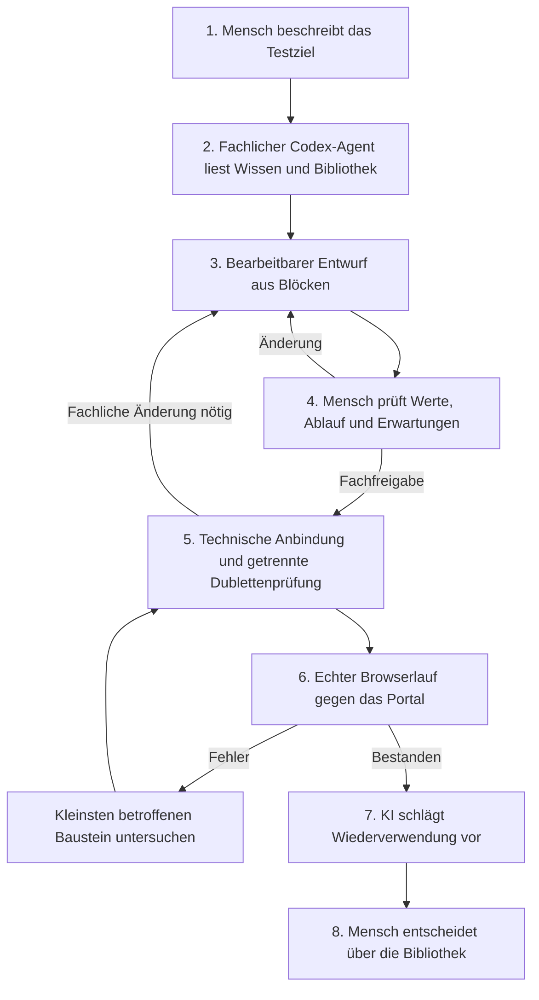

# Wie aus einem Wunsch ein wiederverwendbarer Test wird

Die Grundidee ist eine kleine fachliche Sprache, die beim Arbeiten wächst. Ein Mensch beschreibt zunächst, was er prüfen möchte. Die KI übersetzt diesen Wunsch in sichtbare, bearbeitbare Blöcke. Der Mensch prüft die Bedeutung. Erst anschließend verbindet eine zweite KI-Phase diese Bedeutung mit der tatsächlichen Oberfläche der Versicherung.

Der Satz „Eine Kuh für 15.000 Euro soll eine Direktionsanfrage auslösen“ beschreibt bereits einen guten Test. Er nennt ein versichertes Tier, einen entscheidenden Wert und ein erwartetes Ergebnis. Der Mensch muss dafür zunächst weder den Namen eines Formularfelds noch einen Playwright-Locator kennen.

Die Blöcke machen den Weg dazwischen sichtbar. Man kann einen Wert ändern, einen Schritt ergänzen, eine Rolle wechseln oder in einen zusammengesetzten Block hineinschauen. Die fachliche Absicht bleibt dabei lesbar.

## Zwei getrennte Anwendungen

Das Versicherungsportal liegt unter `/portal`. Es bildet die Arbeit einer Versicherung in einer bewusst nüchternen, blauen Fachanwendung ab. Dort gibt es Kunden, Betriebe, Tiere, Vorschläge, Direktionsanfragen, Verträge und Policen.

Die Testwerkstatt liegt unter `/testing`. Sie enthält die Texteingabe, den grünen Scratch-Arbeitsbereich, die Bibliothek, Wissensdokumente, Prüfungen und Laufbelege. Beide Anwendungen verwenden denselben lokalen Server, haben aber getrennte Oberflächen. Im Versicherungsportal erscheint kein Blockeditor. Ein Browserlauf der Werkstatt bedient das Portal wie ein Benutzer.

Die vorhandenen Regeln sind fiktiv. Sie wurden gewählt, damit fachliche Unterschiede sichtbar und Tests nachvollziehbar sind.

## Die Versicherung verstehen

Ein Kunde kann mehrere Betriebe besitzen. Ein Betrieb hat eine eigene Anschrift und ein Bundesland. Ein Rind, Pferd oder Hund wird einzeln erfasst. Schweine werden als Bestand mit einer Gesamtversicherungssumme geführt. Tiere eines Vorschlags müssen zum gewählten Betrieb und Kunden gehören.

| Tierart | Beispiele für eigene Angaben | Direktionsanfrage bei einer Summe |
| --- | --- | --- |
| Rind | Ohrmarke, Rasse, Geburtsdatum, Nutzung | über 10.000 EUR |
| Pferd | Chipnummer, Nutzung, Gesundheitszustand | über 50.000 EUR |
| Hund | Chipnummer, Rasse, Nutzung | über 10.000 EUR |
| Schweinebestand | Anzahl, Haltungsform, Biosicherheit | über 500.000 EUR für den Bestand |

Pferde mit Vorerkrankung und Schweinebestände mit ungeklärter Biosicherheit brauchen ebenfalls eine Entscheidung. Der Grenzwert selbst löst keine Anfrage aus. Ein Rind mit 10.000 EUR bleibt innerhalb der Grenze; 10.001 EUR liegt darüber. Das Bundesland verändert diese Regeln nicht.



Diese Zustände bestimmen, wie viel Vorbereitung ein Test braucht. Ein Test für eine Direktionsanfrage braucht keinen abgeschlossenen Vertrag. Ein Test für einen erneuten Policendruck braucht dagegen bereits einen abgeschlossenen Vertrag samt Police.

## Der Ablauf in der Testwerkstatt



Die Modellwahl Luna oder Sol wird für den jeweiligen Auftrag gespeichert. Der Server startet die installierte Codex CLI für echte Agentenaufträge. Die App verwendet dafür den nicht interaktiven Befehl `codex exec` mit strukturiertem Ausgabeformat. Fachliche Planung, technische Planung, Dublettenprüfung und Wiederverwendung sind getrennte Aufgaben mit eigenen Ergebnissen und Ereignissen.

Ein fehlgeschlagener CLI-Aufruf bleibt ein fehlgeschlagener Auftrag. Ein fachlicher Entwurf ohne technische Bindung bleibt sichtbar unverdrahtet. Ein erfolgreicher Agentenauftrag ist noch kein erfolgreicher Testlauf.

## Beispiel 1: Eine Kuh mit hoher Versicherungssumme

Die Texteingabe lautet:

> Ich möchte eine Lebensversicherung für eine Kuh. Die Versicherungssumme beträgt 15.000 Euro. Deshalb soll eine Direktionsanfrage auftreten. Der Vertrag soll noch nicht abgeschlossen werden.

Die KI liest die Regel zur Direktionsanfrage. Sie erkennt, dass das Rind die Grenze von 10.000 EUR überschreitet. Außerdem liest sie den Ablauf für Vorschläge. Das Ergebnis ist eine fachliche Komposition:

1. Kunden anlegen.
2. Betrieb für diesen Kunden anlegen.
3. Kuh dieses Betriebs mit 15.000 EUR erfassen.
4. Vorschlag für genau diese Kuh speichern.
5. Angebot berechnen.
6. Antrag einreichen.
7. Prüfen, dass der Vorschlag den Zustand Direktionsprüfung erreicht.

Die ersten vier Schritte stecken im mitgelieferten Block „Kuhlebensversicherung vorbereiten“. Dieser Block endet ausdrücklich beim Entwurf. Der Test setzt seine Versicherungssumme auf 15.000 EUR und ergänzt Berechnung, Einreichung und Prüfung.

Der ebenfalls vorhandene Block „Standard-Kuhlebensversicherung abschließen“ wäre an dieser Stelle ungeeignet. Er setzt voraus, dass keine Direktionsentscheidung erforderlich ist, und möchte den Vertrag abschließen. Ein passender Name allein reicht zur Auswahl eines Blocks also nicht. Die KI muss dessen Vorbedingungen und Endzustand berücksichtigen.

## Beispiel 2: Eine vorhandene Police erneut drucken

Die Texteingabe lautet:

> Ich brauche eine abgeschlossene Standard-Kuhlebensversicherung. Danach möchte ich als Sachbearbeiter die Police erneut ausgeben und drucken. Bitte prüfe, dass der Druckauftrag zur neuen Dokumentversion gehört.

Hier ist der abgeschlossene Vertrag eine Voraussetzung. Der Test kann den kompletten Standardvertrag verwenden und danach sein eigentliches Ziel ergänzen:

```text
Wenn der Test startet
  Standard-Kuhlebensversicherung abschließen
    Versicherungssumme: 3.500 EUR
    Bundesland: Niedersachsen
  Als Sachbearbeiter
    Police erneut ausgeben
      Police: Ergebnis des Standardvertrags
      Grund: Kunde benötigt eine weitere Ausfertigung
    Police drucken
      Police: Ergebnis des Standardvertrags
      Dokument: Ergebnis der erneuten Ausgabe
    Policendruck prüfen
```

Die neue Ausgabe erzeugt eine weitere Dokumentversion derselben Police. Sie erzeugt keinen zweiten Versicherungsvertrag. Der Druckauftrag verweist auf die konkrete Dokument-ID und deren SHA-256. Er weist den angeforderten Druck nach; ein physischer Ausdruck ist nicht Teil des Prototyps.

## Was genau ein Block enthält

Eine Blockdefinition beschreibt eine Fähigkeit. „Betrieb anlegen“ ist beispielsweise eine elementare fachliche Fähigkeit. Sie kennt ihre Eingaben, ihr Ergebnis und ihre Regeln.

| Bestandteil | Beispiel „Betrieb anlegen“ |
| --- | --- |
| Fachliche Bedeutung | Einen Betrieb für einen bekannten Kunden speichern |
| Eingaben | Kunde, Betriebsname, Bundesland, Anschrift, Betriebsart |
| Werttypen | Kundenreferenz, Text, Auswahlwerte |
| Vorbedingung | Der Kunde existiert; die Rolle ist Vermittler |
| Ergebnis | Eine Betriebsreferenz |
| Nachbedingung | Der Betrieb gehört zu genau diesem Kunden |
| Fachwissen | Dokument „Kunde und Betrieb“ |
| Technische Bindung | Das separat gespeicherte Rezept für die Portalinteraktion |

Eine Verwendung dieser Definition ergänzt konkrete Werte. Ein Test verwendet beispielsweise „Betrieb anlegen · 1.0.0“ für den Betrieb Sonnleitner in Niedersachsen. Ein anderer Test verwendet dieselbe Version für einen Betrieb in Bayern. Beide Verwendungen bleiben getrennt.

Ein elementarer Block ist die kleinste fachlich sinnvoll benennbare Handlung. Einzelne Tastendrücke und jedes Formularfeld müssen deshalb nicht zu eigenen Bibliotheksblöcken werden. Die Werte stehen strukturiert im Block. Das hält den fachlichen Ablauf kurz und lässt trotzdem präzise Änderungen zu.

## Werte bearbeiten und Felder ergänzen

Im Block stehen Werte als benannte, typisierte Eingaben. Die Versicherungssumme ist eine Zahl, das Bundesland ein Auswahlwert, und der Kunde eine Referenz auf einen vorherigen Schritt.

Eine Änderung von 3.500 auf 15.000 EUR ist eine lokale Wertänderung. Sie ändert nur diese Verwendung und wird vor einer weiteren Ausführung erneut fachlich geprüft. Eine Ergänzung wie „C = 5“ benötigt außerdem eine fachliche Definition von C. Welchen Werttyp hat es? Was bedeutet es? Ist es erforderlich? Wo wirkt es in der Anwendung?

Der Prototyp weist unbekannte Eingabefelder als fachliche Lücke aus. Nach einer Schemaerweiterung prüft die technische Phase, ob jedes Feld tatsächlich gesetzt oder gegen die Anwendung geprüft wird. Ein zusätzliches Feld darf nicht im Block stehen bleiben, während der Browserlauf es still übergeht.

Tierarten zeigen diesen Unterschied gut. Ein Rind braucht eine Ohrmarke, ein Pferd eine Chipnummer und einen Gesundheitszustand. Der allgemeine Tierblock übernimmt beim Wechsel zu Pferd keine versteckten Kuhwerte. Fehlende Pflichtfelder oder unpassende Angaben sind sichtbare Fehler.

## Blöcke in Blöcken

Der Vorbereitungsblock besteht selbst aus kleinen Blöcken:

```text
Kuhlebensversicherung vorbereiten · 1.0.0
  Kunden anlegen · 1.0.0
  Betrieb anlegen · 1.0.0
  Tier oder Bestand anlegen · 1.0.0
  Versicherungsvorschlag anlegen · 1.0.0
```

Der komplette Standardvertrag enthält diesen Vorbereitungsblock und ergänzt weitere Schritte. Jede Ebene besitzt benannte Ein- und Ausgänge. Dadurch kann ein großer Block übersichtlich bleiben, während seine einzelnen Schritte weiterhin nachvollziehbar und wartbar sind.

Ergebnisse sind echte Verbindungen. Der Betrieb verwendet den Kunden, der unmittelbar zuvor erzeugt wurde. Der Vorschlag verwendet genau diesen Betrieb und dessen Kuh. Bei zwei Verwendungen des Vorbereitungsblocks entstehen zwei voneinander getrennte Gruppen. Gleichnamige interne Ergebnisse geraten nicht durcheinander.

Ein gepinnter Definitionskörper ist der gemeinsame Standard. Eine lokale Abweichung kann einzelne enthaltene Eingaben ändern oder für diese Verwendung einen abweichenden enthaltenen Ablauf vorgeben. Diese Abweichung ist Bestandteil der Fachfreigabe. Sie ändert die Bibliotheksdefinition nicht heimlich.

## Der Wunsch „Bitte den Betrieb in Bayern“

Der Ausgangsblock verwendet Niedersachsen und eine Betriebsanschrift in Uelzen. Die KI kann den Satz „Bitte den Betrieb in Bayern“ auf strukturierte Betriebsparameter abbilden.

| Feld des Betriebs | Standard | Möglicher Vorschlag für diese Verwendung |
| --- | --- | --- |
| Bundesland | Niedersachsen | Bayern |
| Straße | Hofweg 8 | Dorfstraße 12 |
| Postleitzahl | 29525 | 87437 |
| Ort | Uelzen | Kempten |

Die KI muss die ergänzte Anschrift als Annahme zeigen. Der Mensch kann sie übernehmen oder ersetzen. Die Kundenanschrift bleibt unabhängig. Die Änderung beeinflusst keine Direktionsgrenze, weil das Bundesland im fiktiven Produkt keine solche Regel besitzt.

Gespeichert wird die ursprüngliche Absicht im Testfall und die konkrete strukturierte Abweichung in der Blockverwendung. Der ausführbare Browserlauf arbeitet mit diesen Werten, nicht mit einer ungeprüften Interpretation des Satzes zur Laufzeit.

## Was passiert, wenn noch gar kein Block existiert

Ein leerer Katalog ist ein zulässiger Ausgangspunkt. Die fachliche KI darf neue elementare Definitionen anlegen. Dazu gehören ein eindeutiger Name, eine fachliche Kennung, Eingaben, Ergebnisse, Vorbedingungen, Nachbedingungen und mindestens ein Wissensbeleg.

Fehlt auch das Wissen, entwirft sie ein neues Wissensdokument. Es verweist auf die neue Definition, und die Definition verweist zurück auf das Dokument. Der Mensch sieht diese Ergänzungen im Entwurf und kann sie korrigieren. Eine technische Bindung muss zu diesem Zeitpunkt noch nicht existieren.

Nach der Freigabe versucht die technische Phase, die neue Fähigkeit mit vorhandenen Portalaktionen auszuführen. Die technische Ausführung ist nicht auf die mitgelieferten fachlichen Block-IDs beschränkt. Neue Operationen können deklarative UI-Rezepte erhalten. Wenn das Portal das benötigte Feature noch gar nicht besitzt, lautet das Ergebnis allerdings „technische Lücke“. Der Agent darf keine erfolgreiche Ausführung erfinden.

So kann ein Team bereits den Test und seine fachliche Erwartung entwerfen, während eine neue Funktion noch entwickelt wird. Sobald die Funktion vorhanden ist, wird der fehlende elementare Block verdrahtet.

## Was der Mensch freigibt

Die erste Entscheidung betrifft den Testentwurf. Stimmen Tiere, Betriebe, Werte, Reihenfolge, Rollen und Erwartungen? Die Freigabe speichert den Fingerprint dieses fachlichen Stands. Eine geänderte Summe, ein geänderter enthaltener Ablauf oder eine neue Regel macht diese Freigabe veraltet.

Eine Button-Umbenennung verändert dagegen die technische Bindung. Die fachliche Erwartung bleibt dieselbe. Der nächste Lauf verwendet die neue technische Revision, ohne den Menschen denselben unveränderten Fachablauf erneut bestätigen zu lassen.

Die spätere Entscheidung betrifft die Bibliothek. Nach einem erfolgreichen Lauf kann die KI geeignete Teile als wiederverwendbare Blöcke vorschlagen. Ein Vorschlag ist noch keine Veröffentlichung. Der Mensch entscheidet, welche Grenzen und Parameter als Standard sinnvoll sind.

Eine Aufnahme in die Bibliothek kann beispielsweise sowohl „Kuhlebensversicherung vorbereiten“ als auch „Standard-Kuhlebensversicherung abschließen“ ergeben. Die beiden Blöcke haben unterschiedliche Endzustände und sind deshalb für unterschiedliche Tests geeignet.

## Dubletten finden, ohne Fachlogik heimlich zu verändern

Die Dublettenprüfung vergleicht fachliche Bedeutung, Eingabe- und Ergebnisschema, Standardwerte und Komposition beziehungsweise elementaren Vorgang. Der Name allein entscheidet nicht. Reine Unterschiede lokaler Block-IDs und Ergebnisnamen werden beim Kompositionsvergleich normalisiert.

Ein bestehender Block kann geeignet sein, obwohl er anders heißt. Zwei gleich benannte Blöcke können umgekehrt unterschiedliche Pflichtfelder, Standardwerte oder Endzustände besitzen. Der Bericht zeigt Kandidaten, Übereinstimmungen, Unterschiede und eine begründete Entscheidung: wiederverwenden, erweitern oder eigenständig behandeln.

Ein anderer Standardwert ist bereits ein fachlicher Unterschied. Ein Block mit einer Summe von 3.500 EUR ist nicht ohne Prüfung mit einem Block austauschbar, dessen Standard 15.000 EUR beträgt. Eine echte Änderung des fachlichen Ablaufs erzeugt eine neue Testfallrevision und braucht erneute Fachprüfung.

Bei nachgewiesener Gleichwertigkeit verwendet die Aufnahme in die Bibliothek die vorhandene Definition. Sie speichert keinen zweiten identischen Ablauf.

## Wenn ein Button umbenannt wird

Angenommen, „Kunde speichern“ heißt nach einem Portalupdate „Kunde übernehmen“. Der fehlgeschlagene Browserlauf zeigt den betroffenen elementaren Block „Kunden anlegen“ und dessen verwendete Bindungsrevision.

```text
Technische Bindung „Kunden anlegen“
  → elementare Definition „Kunden anlegen · 1.0.0“
    → „Kuhlebensversicherung vorbereiten · 1.0.0“
      → Test „Kuh mit hoher Versicherungssumme“
      → „Standard-Kuhlebensversicherung abschließen · 1.0.0“
        → Test „Police als Sachbearbeiter drucken“
```

Die technische Reparatur ändert nur den Locator dieser kleinsten Bindung und speichert eine neue technische Revision. Der Änderungsfolgenbericht nennt direkte und verschachtelte Nutzer sowie die zu wiederholenden Testfälle. Der fachliche Block und seine Werte bleiben erhalten.

Historische Laufbelege verwenden weiterhin ihre alte Bindungsrevision. Sie werden durch die Reparatur nicht umgeschrieben. Dadurch lässt sich später nachvollziehen, warum der ursprüngliche Lauf scheiterte und welcher neue Lauf die Reparatur belegt.

Eine höhere technische Entwurfsrevision verdrängt eine vorhandene ausführbare Revision noch nicht. Erst eine als bereit gespeicherte Bindung wird für neue normale Läufe ausgewählt. Der reale Browserlauf erbringt anschließend den Funktionsnachweis.

## Was wo gespeichert wird

Die kanonische Blockfolge ist unabhängig vom Arbeitsbereich. Nur Blöcke in der verbundenen Startkette gehören zum Testfall. Lose Blöcke, Positionen, Zoom und eingeklappte Gruppen sind Editorzustand.

Definitionen, Verwendungen, Wissensdokumente, technische Bindungen, Freigaben und Läufe sind getrennte Datensätze. Das Speicherbild und die Versionsregeln sind in [Speicherung und Verbindungen](./storage-model.md) beschrieben. Die API-Verträge stehen in [Testwerkstatt-API](./testing-api.md).
